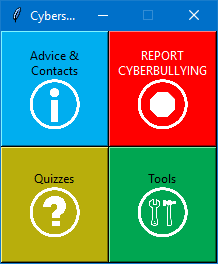
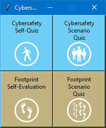
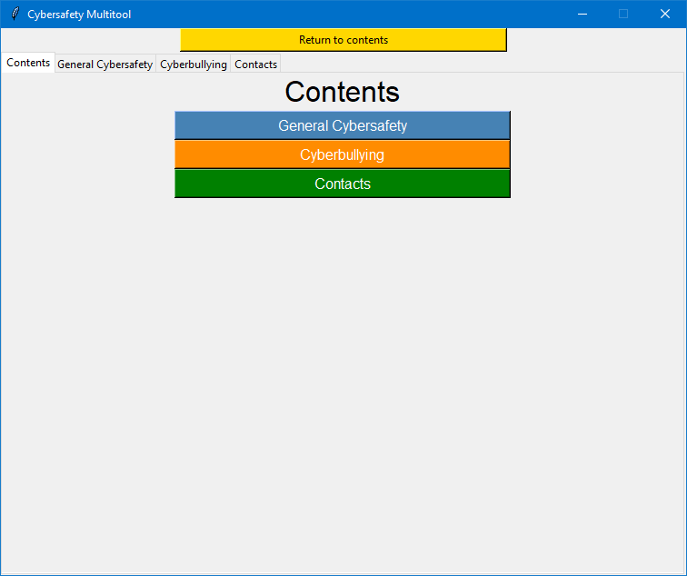

It was exciting to today be announced as the Years 9-10 Winner of the 2019 Queensland Premier's Coding Challenge in the Python/HTML/Javascript category, especialy in my final year of competing in this competition.

For those of you who weren't aware, the challenge for this year was to design a solution to educate users on cybersafety - certainly an important topic given the prevalence of technology in our lives today.

I like to call my entry the **Cybersafety Multitool**, and you will soon discover why.

## Introducing, the Cybersafety Multitool

I think the above screenshot basically sums it up - the **Cybersafety Multitool** was designed to provide a user with a wide range of interactive information surrounding how they can be more cybersafe in their general context.

Some of the features included, just to name a few, are as follows:

* Advice and Contacts
    * Variety of sources of relevant, useful information
* Quizzes
    * Designed to test the user's knowledge on cybersafety and provide advice for future learning
* Tools
    * Password stength checker
    * Strong password generator
* Report Cyberbullying
    * Link to the Australian Office of the e-Safety Comissioner's website

Each of these features have been incorporated in a modular fashion, hence the layout of the main launch screen. Clicking on these buttons opens up different sections of the program, providing different options for the user to explore.

The following screenshot is an example of this, showing the existing quizzes included in the solution:

This layout allows for more quizzes to be added to further develop the solution. A limitation, however, of this structure is that the quizzes shown can become quite cluttered and disorganised, meaning careful organisation would be needed in future iterations.

The next screen shot also demonstrates this. This is the launch screen of the *Advice and Contacts* part of the solution.

Overall, however, this is a very functional prototype design that I look forward to continue developing.

## What's under the hood

Given the limited nature of the competition, Python, and more specifically, the tkinter library, were used to generate the GUI for this solution.

Personally, if this was a production solution, I would rather opt for developing this as a web app or using more prominent desktop GUI libraries. However, this will be a matter for a later date.

*To be continued...*